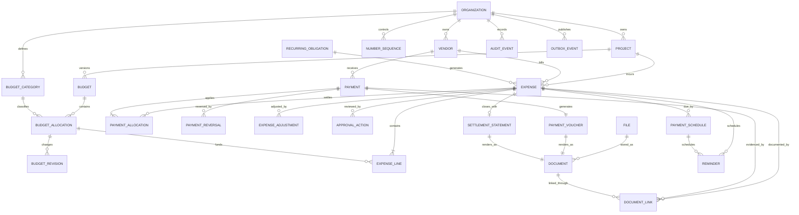
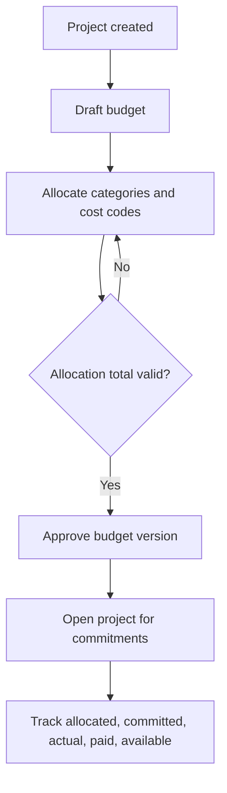
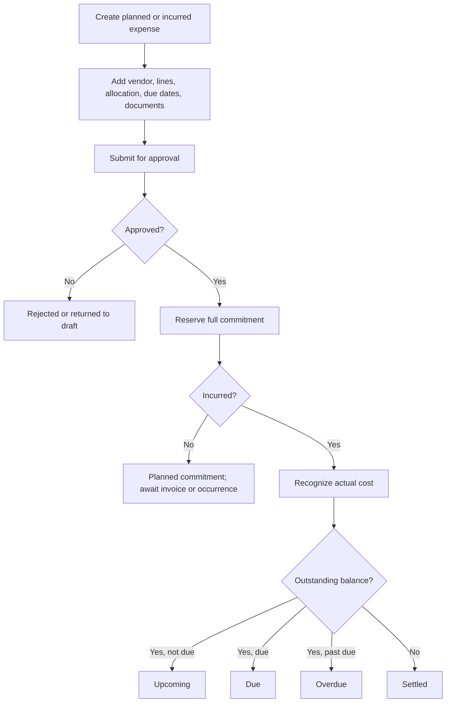
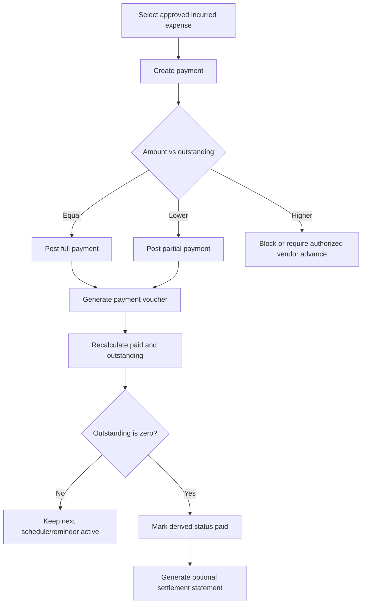
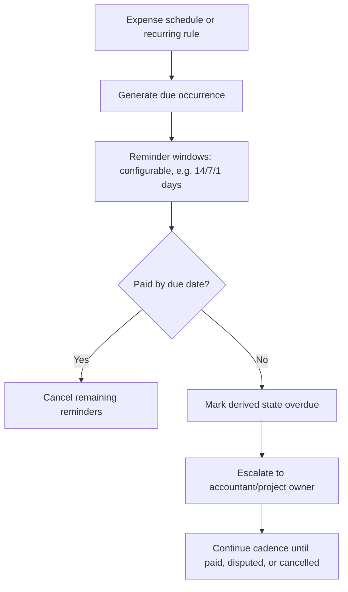
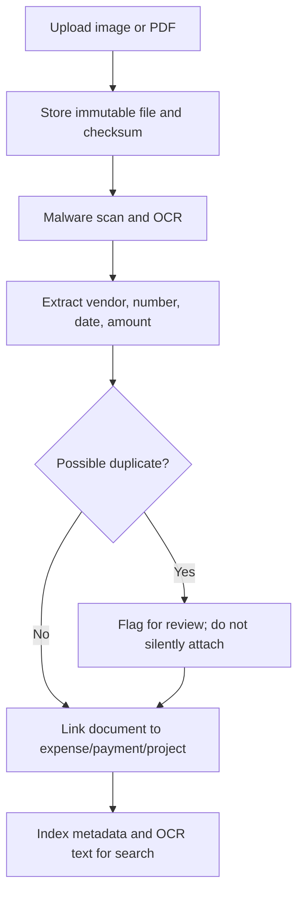

# Zimba financial workflow architecture

## Decision summary

Zimba will use a commitment-based project cost model. An approved expense reserves budget, an incurred expense contributes to actual cost, and a posted payment changes cash paid. These are separate events.

The current overloaded “receipt” concept is retired:

- A supplier invoice or supplier receipt is an external document uploaded to Zimba.
- A payment voucher is an internal, numbered PDF generated for every posted payment.
- A settlement statement is an optional numbered PDF generated when an expense becomes fully settled.

Money is stored as integer minor units. Posted financial records are reversed, never hard-deleted or silently overwritten.

## Core accounting quantities

For each budget allocation:

```text
allocated = approved allocation revisions
committed = approved, non-cancelled expense amount not yet released
actual = incurred, non-voided expense amount net of expense credits
paid = posted payments net of payment refunds/reversals
available = allocated - committed
uncommitted forecast = allocated - actual
cash outstanding = max(actual - paid, 0)
```

`committed` includes the full approved value of an open expense, whether unpaid or partially paid. Payment does not consume budget a second time.

## Entity model



## Tables and responsibilities

### Tenant and project structure

- `organizations`: tenant, base currency, timezone, fiscal settings, numbering policies.
- `projects`: construction/real-estate job and lifecycle status.
- `vendors`: supplier, subcontractor, landlord, employee/payee, tax identity and payment details. “Supplier” becomes a vendor type, not a separate financial concept.
- `budget_categories`: reusable organization categories such as Materials, Labour, Equipment, Transport, Fuel, Permits, and Miscellaneous.

### Budgeting

- `budgets`: project budget header with version and status: `draft`, `approved`, `superseded`, `closed`.
- `budget_allocations`: approved amount for one project/category/cost-code combination.
- `budget_revisions`: append-only increases, decreases, and transfers with reason, approver, and effective date.

Only one approved budget version is active per project. Allocation totals must reconcile to the approved project budget. Transfers are a paired debit/credit revision in one transaction.

### Expenses and obligations

- `expenses`: payable/obligation header. Holds project, vendor, dates, currency, approval state, lifecycle state, vendor reference, terms, and totals.
- `expense_lines`: descriptions, quantity, unit price, tax, and budget allocation. One expense can span categories while still belonging to one vendor and currency.
- `expense_adjustments`: append-only credit notes, refunds at expense level, write-offs, and corrections.
- `approval_actions`: actor, decision, timestamp, comments, and policy snapshot.

Separate orthogonal statuses:

- Approval: `draft`, `submitted`, `approved`, `rejected`.
- Lifecycle: `planned`, `incurred`, `cancelled`, `voided`.
- Settlement (derived): `unpaid`, `partially_paid`, `paid`, `overpaid`, `refunded`.
- Due state (derived): `not_due`, `due`, `overdue`, `settled`.

Settlement and due states are calculated from transactions and dates, never manually selected.

### Payments

- `payments`: one real-world cash movement to a vendor. Includes amount, date, method, account/reference, posting status, idempotency key, creator, and approver.
- `payment_allocations`: joins a payment to one or more expenses. This supports one expense with many payments and one vendor payment settling several invoices.
- `payment_reversals`: append-only reversal/refund transaction linked to the original payment.

Payment states: `draft`, `pending_approval`, `posted`, `failed`, `reversed`. Only `posted` affects paid totals. A posted payment cannot be edited; correction means reversal plus replacement.

### Documents and files

- `files`: immutable object-storage metadata, checksum, MIME type, size, malware-scan state, OCR state, storage key, and retention status.
- `documents`: business metadata: type, source, issuer, document number, issue date, amount, currency, OCR text, verification and duplicate state.
- `document_links`: polymorphic associations to project, expense, payment, or vendor.
- `payment_vouchers`: generated document metadata and immutable voucher snapshot.
- `settlement_statements`: optional final settlement snapshot.
- `number_sequences`: organization/fiscal-year/type sequence with atomic increment.

Document types include `supplier_invoice`, `supplier_receipt`, `delivery_note`, `contract`, `payment_proof`, `payment_voucher`, `credit_note`, and `settlement_statement`.

Suggested numbers:

```text
Payment voucher: ZMB/{ORG}/{FY}/PV/000001
Settlement:      ZMB/{ORG}/{FY}/SS/000001
```

Numbers are unique per organization, type, and fiscal year. Cancelled numbers remain reserved for auditability.

### Scheduling and notifications

- `payment_schedules`: due installments belonging to an expense; amount and due date must reconcile with the expense total unless explicitly marked estimated.
- `recurring_obligations`: recurrence rule, vendor, project, allocation, expected amount, lead time, start/end dates, and next occurrence.
- `reminders`: generated reminder occurrence with target, scheduled time, delivery state, and deduplication key.
- `notifications`: in-app/email/SMS delivery records and read state.

Recurring obligations create draft expenses or planned schedule entries; they never create posted payments automatically without an explicitly configured and approved autopay policy.

### Governance

- `audit_events`: append-only before/after metadata for every financial action.
- `outbox_events`: transactional events for PDFs, notifications, search indexing, and analytics.
- Every business table contains `organization_id`, timestamps, creator, and concurrency version.

## End-to-end workflow

### Project and budget



Initial allocations exist before spend. Changing an approved budget creates a revision; it does not rewrite history.

### Expense lifecycle



### Full and partial payments



Every partial payment creates its own payment and voucher. Five installments produce five immutable payment records and vouchers, plus an optional final settlement statement.

### Upcoming, overdue, and recurring obligations



### Supplier-document upload



## Scenario behavior

| Scenario | Records and status | Financial effect |
| --- | --- | --- |
| Planned, unpaid | Approved `expense` in `planned`; schedule/reminders | Commitment increases; actual and paid unchanged |
| Incurred, unpaid | Expense becomes `incurred`; no payment | Commitment and actual increase; outstanding equals net expense |
| Paid immediately | Expense plus posted payment/allocation/voucher in one transaction boundary | Actual and paid increase; outstanding zero |
| Paid later | Expense first; payment later | Outstanding remains until payment posts |
| Partial payment | New payment and allocation for each installment | Outstanding = net expense - net posted payments |
| Cancelled planned expense | Lifecycle `cancelled` with reason | Commitment released; no deletion |
| Cancelled incurred expense | Credit/void workflow, approval required | Actual reversed through adjustment; audit retained |
| Refund | Reversal/refund linked to original payment; optional vendor credit | Net paid decreases; outstanding or vendor credit recalculated |

## Edge-case policy

- Overpayment: blocked by default. Authorized users may record it only as a vendor advance/unapplied credit, never as negative expense balance hidden inside an expense.
- Duplicate receipt/invoice: detect with organization, vendor, document number, amount/date, and file checksum. Warn and require override permission/reason.
- Deleted payment: draft payments may be deleted; posted payments must be reversed.
- Edited payment: drafts are editable. Posted records require reversal and replacement.
- Cancelled expense: release commitment only after cancellation approval. Existing posted payments must first be refunded, reallocated, or represented as vendor credit.
- Expense above budget: warn at threshold; block approval unless an authorized override or budget revision exists.
- Payment before approval: record as `pending_approval` or vendor advance; do not allocate to an unapproved expense.
- Multiple documents: allowed. Documents have types and one may be marked primary; none determines payment truth.
- Currency mismatch: no cross-currency allocation without stored exchange rate and base-currency amounts.
- Concurrency: posting and allocation use row locks/version checks to prevent two users paying the same outstanding balance.

## System invariants

1. Sum of active payment allocations cannot exceed a posted payment amount.
2. Expense paid amount is derived; clients cannot set it.
3. Expense settlement status is derived; clients cannot set it.
4. Posted entries are immutable.
5. Voucher generation is idempotent: one active voucher per posted payment version.
6. All totals are organization-scoped and calculated server-side.
7. Budget changes, overrides, reversals, and duplicate overrides require reason and audit actor.
8. Files are never publicly addressable; access uses short-lived signed URLs.

## Scalable architecture

Use a modular financial core backed by PostgreSQL:

- Budget module owns versions, allocations, revisions, and commitment summaries.
- Payables module owns expenses, lines, approvals, schedules, and adjustments.
- Payments module owns cash movements, allocations, reversals, and idempotency.
- Document module owns files, OCR, duplicate detection, vouchers, and statements.
- Notification module owns recurrence, reminders, calendars, and delivery.
- Reporting module consumes transactional outbox events into read models.

The transactional database is authoritative. PDF generation, OCR, notifications, and search indexing run asynchronously from an outbox, but payment posting and number reservation occur synchronously in one database transaction. Start as a modular monolith; split workers and high-volume read models only when scale requires it.
