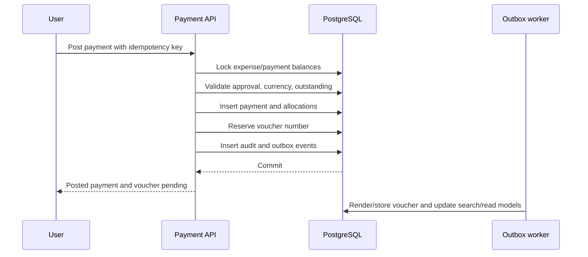

# Zimba financial workflow implementation plan

## Objective

Replace the current receipt-centric expense flow with the approved commitment, payable, payment, and document architecture without losing existing customer data or requiring a big-bang release.

## Current-state problems to remove

- `payment_status` is writable on expenses instead of derived from payments.
- `amount_paid` is stored/submitted on expense creation without a payment ledger.
- A “receipt” acts as both expense-entry container and evidence.
- Receipt items can carry different suppliers, which conflicts with a real vendor document header.
- Upcoming payments are disconnected from expenses and do not settle automatically.
- Browser/mock stores duplicate financial truth.
- Budget `spent` conflates commitments, actual cost, and cash paid.

The interrupted per-line payment-status frontend change should not be completed. It deepens the incorrect model and should be replaced in the migration phase.

## Delivery strategy

Use a strangler migration behind organization feature flags:

1. Add the new tables and read models beside legacy tables.
2. Backfill and reconcile legacy data.
3. Dual-read for verification; avoid dual-writing financial transactions unless wrapped by one backend service.
4. Enable new workflows for internal/test tenants.
5. Migrate tenants in cohorts.
6. Freeze legacy writes, verify, then remove compatibility fields.

## Phase 0 — policy and contracts

Deliverables:

- Confirm organization base currency, fiscal year, approval thresholds, roles, and voucher naming.
- Publish status transition matrices and role permissions.
- Define money, timezone, exchange-rate, tax, and retention policies.
- Freeze new work on expense-level payment status and receipt-level payment semantics.
- Add API versioning strategy (`/api/v2` recommended for breaking financial contracts).

Acceptance:

- Finance/product/engineering sign off on invariants and terminology.
- Every status has one owner: stored workflow state or derived financial state, never both.

## Phase 1 — database foundation

Create migrations in dependency order:

1. `budget_categories`, `budgets`, `budget_allocations`, `budget_revisions`.
2. `vendors`, `expenses`, `expense_lines`, `expense_adjustments`, `approval_actions`.
3. `payments`, `payment_allocations`, `payment_reversals`.
4. `files`, `documents`, `document_links`, `number_sequences`, `payment_vouchers`, `settlement_statements`.
5. `payment_schedules`, `recurring_obligations`, `reminders`, `notifications`.
6. `audit_events`, `outbox_events`.

Database controls:

- Organization foreign keys on all tenant data.
- Integer money and explicit currency.
- Unique vendor invoice reference where policy requires it.
- Unique idempotency keys for payment posting.
- Unique voucher number and one active voucher per payment.
- Check constraints for positive lines and allocations.
- Partial indexes for active/due records.
- Row version fields for optimistic concurrency.

Acceptance:

- Migration runs forward and backward in a staging clone.
- Tenant-isolation and financial-invariant database tests pass.

## Phase 2 — domain services and posting engine

Build services in this order:

1. Budget service: approve/revise/transfer allocations and calculate balances.
2. Expense service: draft, submit, approve, incur, cancel, adjust.
3. Payment service: draft, approve, post, allocate, reverse/refund.
4. Numbering service: reserve fiscal sequences transactionally.
5. Document service: upload, scan, OCR, link, detect duplicates.
6. Voucher service: render immutable snapshot PDF after payment posting.
7. Scheduling service: create due occurrences and recurring expense drafts.
8. Notification service: reminder dedupe, escalation, delivery preferences.

Posting transaction:

Acceptance:

- Retrying the same request never duplicates a payment or voucher.
- Concurrent payments cannot over-settle an expense.
- Reversal restores all derived balances exactly.

## Phase 3 — API redesign

Primary endpoints:

- `POST /api/v2/projects/{id}/budgets`
- `POST /api/v2/budgets/{id}/approve`
- `POST /api/v2/budget-allocations/{id}/revisions`
- `POST /api/v2/expenses`
- `POST /api/v2/expenses/{id}/submit|approve|incur|cancel`
- `GET /api/v2/expenses/{id}/balance`
- `POST /api/v2/payments`
- `POST /api/v2/payments/{id}/approve|post|reverse`
- `GET /api/v2/payments/{id}/voucher`
- `POST /api/v2/documents/uploads`
- `POST /api/v2/documents/{id}/links`
- `GET /api/v2/payment-calendar`
- CRUD endpoints for schedules and recurring obligations.

API rules:

- Remove writable `payment_status` and `amount_paid` from expense commands.
- Return `settlement_status`, `paid_amount`, and `outstanding_amount` as calculated fields.
- Use action endpoints for auditable transitions rather than unconstrained patches.
- Return conflict details for overpayment, duplicate documents, stale versions, and budget overruns.
- Publish concrete OpenAPI schemas and examples for every state.

Acceptance:

- Contract tests cover every transition and prohibited transition.
- Organization isolation, authorization, pagination, and idempotency are proven.

## Phase 4 — data migration

Migration mapping:

- Existing project budgets become approved budget version 1.
- Existing allocations become category/cost-code allocations.
- Legacy receipt groups become expense headers only when vendor/currency/date are compatible; otherwise split by vendor.
- Legacy expense rows become expense lines.
- `paid` legacy expenses create one synthetic posted opening-balance payment.
- `partially_paid` expenses require a reliable amount; if unavailable, enter an exception queue instead of assuming 50%.
- Legacy receipt files become `supplier_receipt` documents, never payment vouchers.
- Upcoming payments become schedules when linked confidently; otherwise become planned expenses requiring review.

Every migrated record stores `legacy_source`, `legacy_id`, migration batch, and reconciliation state.

Reconciliation reports compare:

- Project allocated totals.
- Expense gross/net totals.
- Paid and outstanding totals by vendor/project.
- Counts and checksums of migrated documents.
- Legacy-to-new record coverage and exceptions.

Acceptance:

- Zero unexplained monetary variance per organization.
- All uncertain partial payments are reviewed before tenant cutover.
- Migration is restartable and idempotent.

## Phase 5 — workflow replacement

Replace product behavior in dependency order:

1. Budget setup shows allocated, committed, actual, paid, and available.
2. Expense creation captures obligation details and supplier documents, not payment status.
3. Expense approval reserves budget.
4. Expense detail exposes calculated balance and payment history.
5. Record-payment flow creates one payment transaction and voucher.
6. Payment calendar reads schedules/recurrence, not standalone upcoming-payment cards.
7. Document center distinguishes external supplier documents from internal vouchers.
8. Reports and vendor ledgers use new read models.

Do not place payment status or amount-paid inputs on expense line items. Payment allocation is a separate workflow after the expense exists, except “paid immediately,” which orchestrates expense approval/incurrence and payment posting as separate records in one guided operation.

Acceptance journeys:

- Approved unpaid invoice reduces available budget and appears upcoming.
- Three partial payments show three vouchers and one declining balance.
- Final installment marks the expense paid and offers a settlement statement.
- Payment reversal reopens the correct balance and preserves the original voucher as reversed.
- Supplier receipt upload is searchable and never confused with a Zimba voucher.

## Phase 6 — reminders, recurrence, and automation

- Generate future occurrences in a bounded rolling window.
- Recalculate due/overdue state from organization timezone.
- Send configurable reminders with dedupe keys.
- Stop reminders when settled, cancelled, disputed, or rescheduled.
- Escalate overdue obligations based on amount, age, and role policy.
- Add calendar feeds/exports only after internal calendar correctness is proven.

Acceptance:

- No duplicate reminders after worker retries.
- Recurrence changes do not rewrite already generated expenses.
- Timezone and month-end cases pass automated tests.

## Phase 7 — reporting, controls, and scale

- Build materialized/read-model summaries from outbox events.
- Add aging reports, budget variance, commitments, cash requirements, vendor statements, and audit exports.
- Partition high-volume audit/outbox tables when needed.
- Add object-storage lifecycle, OCR retry/dead-letter handling, observability, and backup restore drills.
- Measure posting latency, voucher generation lag, reminder lag, reconciliation exceptions, and failed outbox events.

## Test plan

- Unit: balance formulas, statuses, recurrence, numbering, permissions.
- Property-based: random payment/reversal sequences preserve invariants.
- Integration: transactional posting, row locks, outbox, organization isolation.
- Contract: OpenAPI request/response and error shapes.
- Migration: golden organizations covering paid, partial, unpaid, cancelled, and malformed legacy data.
- Document: deterministic PDF snapshots, checksum, access control, duplicate detection.
- End-to-end: all acceptance journeys at desktop and mobile widths after business logic passes.
- Financial reconciliation: debit/credit-style control totals before every cohort cutover.

## Recommended release slices

| Release | Scope | Exit criterion |
| --- | --- | --- |
| R1 | New schema, budget balances, expense approvals | Commitments reconcile; no payment UX yet |
| R2 | Payment ledger, allocations, reversals, vouchers | Partial/full/refund journeys pass |
| R3 | Documents, OCR, duplicate detection | Supplier evidence is searchable and controlled |
| R4 | Schedules, recurrence, calendar, reminders | Due/overdue automation is reliable |
| R5 | Cohort migration and legacy shutdown | Zero unexplained variance; old writes disabled |

## Explicit non-goals for the first release

- Full general ledger, bank reconciliation, payroll engine, procurement/Purchase Orders, tax filing, and automatic bank payouts.
- These can integrate later through stable expense/payment events; they should not delay correcting the core payable ledger.

